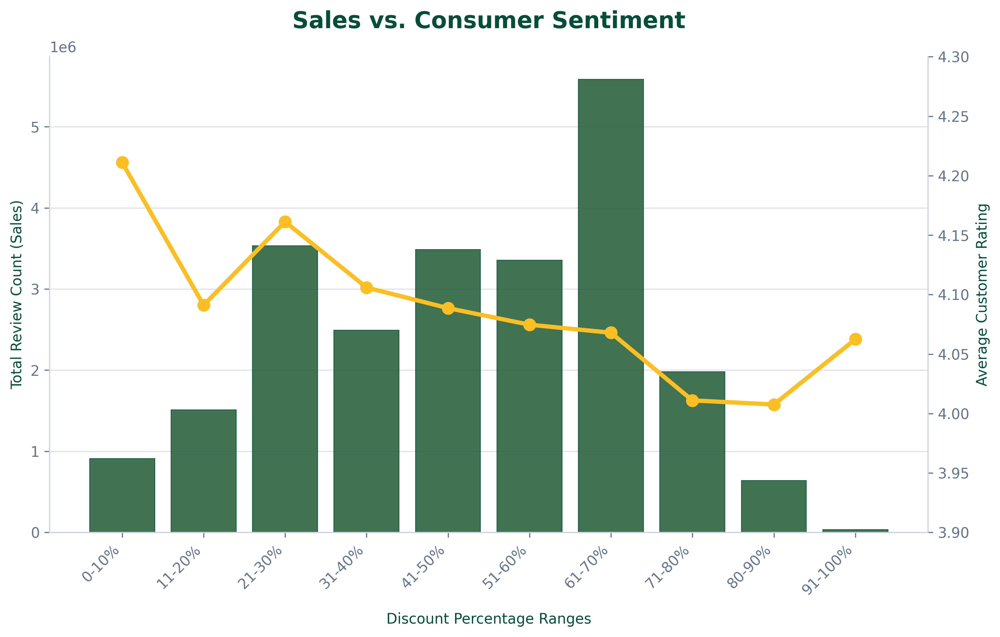
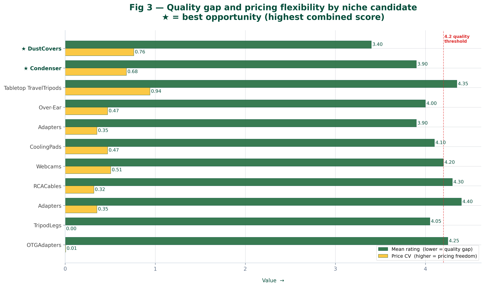
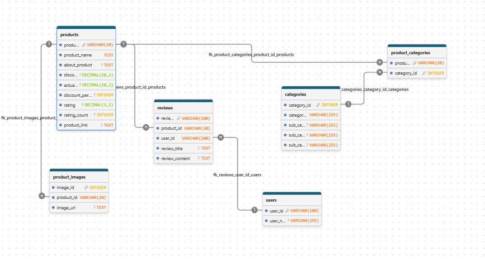

# Decoding the Amazon Marketplace
### A Data-Driven Business Case for PandaMonium Goods

## The Finding
Amazon's Home & Kitchen category is packed with **easy-to-enter, underserved niches**: 
low-competition, high-demand product types (dust covers, condensers) where quality bars 
are low and pricing is flexible enough to enter at a premium. We identified specific 
niche candidates and scored them by opportunity size — this is where PandaMonium 
should launch first.

## Key Results

**Premium pricing signals quality** (H1 — Zidene)  
Higher-priced products show a much higher share of "Excellent" ratings and almost no 
poor ratings — price positively predicts perceived quality across the catalog.

**Discounting has a ceiling** (H2 — Claire)  
  
Sales volume climbs with discount depth up to ~70% off — but past that, sentiment drops. 
Heavy discounting doesn't kill sales, but it does erode perceived value. Recommendation: 
cap promotional discounts at 65%.

**There are real gaps in the market** (H3 — Claire)  
  
By combining review volume, listing count, and price variability, we scored niche 
candidates on demand vs. competition. Dust covers and condensers surfaced as the top 
opportunities — high demand, low competition, and room for premium pricing.

## Data Pipeline
Beyond the CSV analysis, we modeled and loaded the dataset into a normalized SQL 
database (products, categories, reviews, users, product_images) to practice relational 
schema design.  

## Recommendations
- Enter niches with high demand + low listing competition (see H3 scoring)
- Cap discounts at 65% — steeper discounts don't move volume but do hurt sentiment
- Price toward the premium end where possible — data shows it correlates with satisfaction, not against it

## Repo Structure

first_project
├─ config.yaml
├─ data
│  ├─ clean
│  │  └─ amazon_cleaned.csv
│  └─ raw
├─ figures
│  ├─ discount_rating.png
│  ├─ discount_sales.png
│  ├─ ERD.PNG
│  ├─ fig2_niche_scatter.png
│  ├─ fig3_niche_quality_price.png
│  ├─ fig4_categories_rating.png
│  └─ fig5_rating_distribution_by_price.png
├─ notebooks
│  ├─ branding_colors.ipynb
│  ├─ create_sql_csv.ipynb
│  ├─ data_cleaning_claire.ipynb
│  ├─ eda_claire.ipynb
│  ├─ explore_clean_data_zidene.ipynb
│  ├─ extra_tables_zidene.ipynb
│  ├─ functions.py
│  └─ __pycache__
│     ├─ functions.cpython-313.pyc
│     └─ functions.cpython-314.pyc
├─ pyproject.toml
├─ README.md
├─ slides
│  └─ Amazon Sales Strategy Analysis.pdf
├─ sql_scripts
│  ├─ categories.csv
│  ├─ categories_insert.sql
│  ├─ create_project1_amazon.sql
│  ├─ ERD.PNG
│  ├─ products.csv
│  ├─ products_insert.sql
│  ├─ product_categories.csv
│  ├─ product_categories_insert.sql
│  ├─ product_images.csv
│  ├─ product_images_insert.sql
│  ├─ reviews.csv
│  ├─ reviews_insert.sql
│  ├─ users.csv
│  └─ users_insert.sql
├─ src
│  └─ project_template
│     └─ __init__.py
└─ uv.lock

## How to Run
1. Cleaned data stored in `data/clean/amazon_cleaned.csv`
2. Notebooks import shared helpers from `notebooks/functions.py`
3. Open `data_cleaning_claire.ipynb` → `eda_claire.ipynb` / `explore_clean_data_zidene.ipynb` to reproduce analysis
4. To reproduce the SQL side: run `create_sql_csv.ipynb`, then execute the `.sql` scripts in `sql_scripts/` in order (categories → products → product_categories → product_images → users → reviews)

## Data Source
[Amazon Sales Dataset, Kaggle](https://www.kaggle.com/datasets/talalhakem/amazon)

## Presentation
https://docs.google.com/presentation/d/1or2I0dxIeo96H9ww6bakcm8ZBFywKj_Gzh_ZptvTnnY/edit?slide=id.g3e4aa31e4e8_0_1#slide=id.g3e4aa31e4e8_0_1

## Contributions
Claire: data cleaning, discount/rating relationship (H2), niche opportunity scoring (H3), SQL schema + load, business recommendations  
Zidene: pricing/quality relationship (H1)
sfaction, not against it

## Repo Structure
